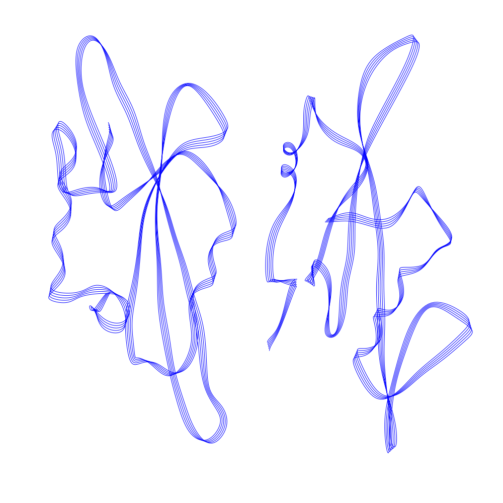

# Plotting Ribbons

An easy way to use [fogleman/ribbon](https://github.com/fogleman/ribbon) to create ready to plot SVGs like these:




## Create SVGs

Install [fogleman/ribbon](https://github.com/fogleman/ribbon) and get the source code.

```bash
go get -u github.com/fogleman/ribbon/cmd/rcsb
git clone git@github.com:fogleman/ribbon.git
```

Run the lines cmd with `go run ribbon/cmd/lines/main.go` with a 4-digit RCSB Structure ID to print all lines to the console. With the following cmd you can save all 4-digit RCSB Structure IDs in `ids` and as SVGs. You can set IDs for example with `ids="1A08 6UFW"` and run the following cmd to create the SVGs.

```bash
for id in $ids; do echo $id; go run ribbon/cmd/lines/main.go $id | python -c "import sys
points = [str(round((float(num)+1)*500*1e6)/1e6) for num in sys.stdin.read()[:-1].replace('\n',',').replace(';',',').split(',')]
lines = [points[:4]]
for i in range(4,len(points), 4):
    if lines[-1][-2:] == points[i:i+2]: lines[-1].extend(points[i+2:i+4])
    else: lines.append(points[i:i+4])
polyline_strs = ['<polyline fill=\"none\" stroke=\"#00f\" points=\"' + ' '.join(line) + '\"/>' for line in lines]
with open('$id.svg','w') as f: f.write('\n'.join(['<svg xmlns=\"http://www.w3.org/2000/svg\" height=\"26.45834cm\" viewBox=\"0 0 1000 1000\" width=\"26.45834cm\">']+polyline_strs+['</svg>']))"; done
```

## Get RCSB Structure IDs

You can go to the [Protein Data Bank](http://www.rcsb.org) main page or [search](http://www.rcsb.org/search?q=*) to find a structure.

All IDs up to the end of 2020 are in `all_ids_01_2021.txt`. Run the following cmd to get all ids in a certain range and save it to ids.

```bash
ids=$(cat all_ids_01_2021.txt | cut -c1-50) # get ids from 1-50 (10*5) get the first 10 ids
echo $ids
```